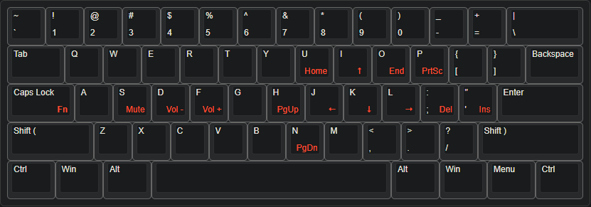

# AutoHotkey script
Script for [AutoHotkey](https://www.autohotkey.com/) that creates a secondary keyboard layer for easy access to the navigation cluster and volume controls.
## Layout

## Features
### Accessing secondary layer
* Secondary layer is accessed by holding down `CapsLock`.
* `CapsLock` still functions as normal when tapped.
### Backspace
* `Backspace` swapped with `\`
### Space Cadet Shift
* Left and right `Shift` keys now output opening parenthesis `(` and closing parenthesis `)`, respectively, when tapped.
* When held down they function normally.
### Volume Controls
  * `Mute` on `S`
  * `Volume Down` on `D`
  * `Volume Up` on `F`
### Navigation Cluster
The Navigation Cluster is laid out to be easily accessed with the right hand without moving your hand away from your typing position. The Navigation Cluster layout is focused around the placement of the arrow keys and is easy to remember the placement when broken down into groups.
* #### Arrows 
  * The arrow keys are placed on `I` `J` `K` `L` and maintains their natural positions.
* #### Home/End
  * `Home` on `U`
  * `End` on `O`.
* #### Page Up/Page Down
  * `Page Up` on `H` 
  * `Page Down` on `N`
* #### Delete/Insert
  * `Delete` on `;`
  * `Insert` on `'`
* #### Print Screen
  * `Print Screen` on `P`
* #### Windows 10 Virtual Desktop Switching
  * `Previous Virtual Desktop` on `,`
  * `Next Virtual Desktop` on `.`
* #### Browser Back/Forward (primarily for ThinkPad keyboards)
  * `Browser Back` on `PgUp`
  * `Browser Forward` on `PgDn`